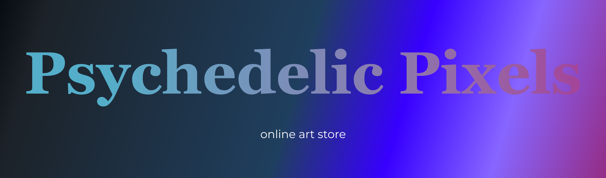

<p align="center">
  
  
  
  
  
  
  
  
  
  
  
</p>

<br />


# About me 
```jsx
import { sushi as favFood } from "@andre/likes";

const NAME = "Andre van Heerden";
const STUDENT_NUM = 241155;
const AGE = 21;
const BIRTHDAY = "November 6";
const NATIONALITY = "South African";
const STUDIES = {
  uxDesign: "Second Year UX",
  development: "Second Year DV",
};

let hobbies = {
  reading: ["Books", "Web Novels", "Manga", "Manhwa", "Manhua"],
  favoriteGenres: ["Dark Fantasy", "Reincarnation"],
  watching: ["Anime"],
  nature: ["Fishing (Fly Fishing & Deep Sea Fishing)", "Hunting", "Shooting"],
  art: ["Drawing", "Pen Sketches"],
};

let dreamJob = ["Frontend Developer", "UX Designer"];

export async function codingSession() {
  let enjoyFrontend = true;
  let designMood = "active";

  while (enjoyFrontend) {
    design("beautiful interfaces");
    code("interactive experiences");
    if (bugAppears()) {
      console.log("One more tweak…");
      fixBug();
    }
  }
}

function favThings() {
  return {
    food: favFood,
    hobbies,
    dreamJob,
  };
}

let changelog = [
  "Discovered sushi as peak cuisine 🍣",
  "Fell deeper into dark fantasy worlds 📚",
  "Improving frontend flow & UX every day 💻",
  "Still chasing the perfect UI design ✨",
];

```


- - - -

<br />

# Skills 

<table align="center">
  <tr>
    <td>
      <div style="width: 250px; height: 150px;">
        <strong>UX Design</strong><br /><br />
        <span style="color: #666;">Strong 8/10</span><br /><br />
        
      </div>
    </td>
    <td>
      <div style="width: 250px; height: 150px;">
        <strong>UI Design</strong><br /><br />
        <span style="color: #666;">Strong 8/10</span><br /><br />
        
      </div>
    </td>
    <td>
      <div style="width: 250px; height: 150px;">
        <strong>Frontend Development</strong><br /><br />
        <span style="color: #666;">Strong 7/10</span><br /><br />
        
      </div>
    </td>
    <td>
      <div style="width: 250px; height: 150px;">
        <strong>Backend Development</strong><br /><br />
        <span style="color: #666;">Improving 6/10</span><br /><br />
        
      </div>
    </td>
  </tr>
  <tr>
    <td>
      <div style="width: 250px; height: 150px;">
        <strong>Database Development</strong><br /><br />
        <span style="color: #666;">Improving 5/10</span><br /><br />
        
      </div>
    </td>
    <td>
      <div style="width: 250px; height: 150px;">
        <strong>Deployment</strong><br /><br />
        <span style="color: #666;">Needs a lot of improvement 4/10</span><br /><br />
        
      </div>
    </td>
    <td>
      <div style="width: 250px; height: 150px;">
        <strong>Bug Fixing</strong><br /><br />
        <span style="color: #666;">Needs a lot of improvement 3/10</span><br /><br />
        
      </div>
    </td>
    <td>
      <div style="width: 250px; height: 150px;">
        <strong>Connecting Code</strong><br /><br />
        <span style="color: #666;">Good 7/10</span><br /><br />
        
      </div>
    </td>
  </tr>
</table>

<p align="center">
*Rating out of 10 is on a second-year level*
</p>


- - - -

<br />

# Tech Stack 

## Languages & Frameworks


## Styling


## Databases & Data Management


## Tools & Libraries


- - - -

<br />

#  2025 (Second year) Portfolio Repos 
## [Monaware](https://github.com/andrevanheerden/formative-one-Monaware) (Semester 1)

[](https://github.com/andrevanheerden/formative-one-Monaware)

Monaware is an app built using the D&D 5e SRD API, which provides comprehensive data on Dungeons & Dragons 5th Edition, including skills, equipment, spells, monsters, and more. Monaware focuses specifically on the monsters database, allowing users to view all stats and data for monsters or encounters. Users can access detailed information such as ability scores (Strength, Dexterity, Constitution, etc.), saving throws, skills, hit points, armor class, attack abilities, damage, and other important combat and lore-related stats.

In addition, Monaware allows users to compare the stats of two monsters or encounters side by side, making it easy to analyze strengths, weaknesses, and overall challenge levels for planning encounters. Since the D&D 5e SRD API does not include images for around 70% of monsters, the images used in Monaware were sourced from a community post on the D&D 5e SRD Discord. This ensures that users have a visually engaging experience while browsing monsters and encounters.

#### **Technologies Used:**


[](https://nice-field-04395f01e.1.azurestaticapps.net/)

[](https://github.com/andrevanheerden/formative-one-Monaware)

- - - -


## [Psychedelic Pixels](https://github.com/GabyNor05/Psychpix) (Semester 1)

[](https://github.com/GabyNor05/Psychpix)

Psychedelic Pixels is an e-commerce platform dedicated to showcasing and selling unconventional, surreal, and imaginative artwork. The website offers a curated selection of unique paintings, sculptures, and other artistic creations that fall outside the mainstream. Its primary purpose is to give art lovers, collectors, and curious minds a place to discover and purchase "weird art" works that are bold, thought-provoking, and unlike anything found in traditional galleries. By connecting eccentric artists with an audience that appreciates the bizarre and the extraordinary, Psychedelic Pixels celebrates creativity in its most unusual forms.

#### **Technologies Used:** 


[](https://github.com/GabyNor05/Psychpix)

- - - -


## [Yggdrasil](https://github.com/andrevanheerden/Yggdrasil) (Semester 2)

[](https://github.com/andrevanheerden/Yggdrasil)

Yggdrasil is a website form Dungeon Masters and D&D players alike. This website seeks to streamlines the campaign-running experience for new and old players to run a D&D campaign. we will integrate game style inventory system as well as a full creatine system where you can create new classes, spells, weapons, items, monsters, characters and more. I created Raven Watch because I find using apps like D&D beyond tiring because you have to pay for services and the elements are not perfectly organized for running a campaign. 

#### **Technologies Used:** 


[](https://github.com/andrevanheerden/Yggdrasil)

- - - -

<br />

#  My Stats 


<p align="center">
  
  
</p>


<br />
